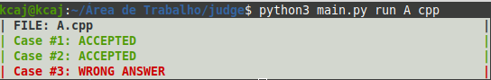

# Como rodar:
```sh
python3 judge.py <command> <filename> <extension>
```
# Configurando

Antes de rodar, crie um arquivo de template com a extensão da linguagem que você deseja na pasta `utils` (veja o exemplo em cpp já existente.

# Comandos

## create

Cria o ambiente pro judge funcionar com a seguinte estrutura:

```txt
   - <filename>.<extension>
   - <filename>_inp
   - <filename>_judge_out
```
O arquivo de código vai ter o que for definido no template, os arquivos de entrada e saida vão estar vazios, preencha com a entrada e saída válidas da questão.

## run

Compila o arquivo de código passado por parametro, compila o arquivo criando um executavel e roda os casos de teste definidos no arquivo *_inp* salvando as suas saídas no arquivo `<filename>_user_out` e depois compara os arquivos com as saídas indicando se as respostas coincidem ou não.
Para testar varios casos diferentes em um caso só considere ler até o final do arquivo de entrada inserindo varios casos em um mesmo arquivo de entrada.



## TODO
 - [ ] adicionar tempo limite nas questões